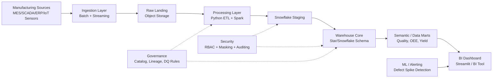

# Architecture Diagram and Design

## Layer Responsibilities

1. **Source systems**
   - Machine telemetry, quality inspections, production records, shift/operator logs.
2. **Ingestion**
   - Batch for ERP/MES extracts.
   - Streaming for sensor events and inline inspection alerts.
3. **Storage + Processing**
   - Raw immutable storage for replayability.
   - ETL/ELT standardization, schema validation, deduplication.
4. **Warehouse**
   - Conformed dimensions and process-specific fact tables.
5. **Consumption**
   - KPI dashboard: defect rate, DPMO, first-pass yield, MTTR, Pareto charts.

## Non-Functional Design

- **Scalability**: partition by event date and factory/site.
- **Reliability**: idempotent loads, checkpointing for streaming.
- **Security**: least privilege access model and masking for operator PII.
- **Governance**: data quality scorecards and lineage documentation.
